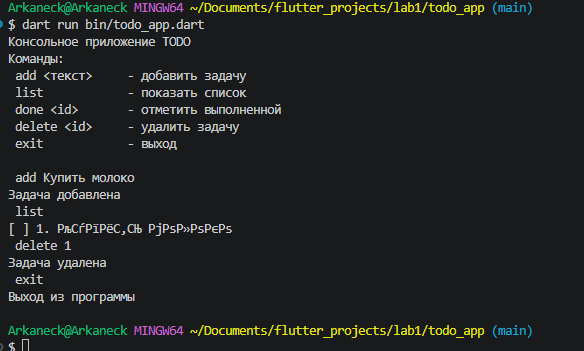

# Консольное приложение TODO list

Простое консольное приложение на языке Dart для управления списком задач (TODO). Позволяет добавлять, просматривать, отмечать выполненные и удалять задачи. Проект создан для изучения основ Dart: работа с коллекциями, ввод/вывод, асинхронность и ООП.

## Автор

- **Имя:** Березкин Роман, Зубрева Эля
- **Группа:** ИСП-233

## Скриншот приложения



## Как запустить

1. **Клонировать репозиторий**

```bash
git clone https://github.com/pomarulit007-cyber/Flutter_Lab1.git
cd Lab1
```
2. **Убедиться, что установлен Dart**
Скачать можно с dart.dev/get-dart

Проверить установку:
```bash
dart --version
```
3. Установить зависимости (если есть)
```bash
dart pub get
```
4. Запустить приложение
```bash
dart run bin/todo_app.dart
```
## Что изучили

* Работа с пользовательским вводом через stdin и stdout в Dart

* Использование коллекций (List, Map) и методов работы с ними (forEach, isEmpty)

* Основы ООП: классы, конструкторы, статические поля

* Обработка исключений с помощью try-catch

* Именованные конструкторы в Dart и их отличие от перегрузки в C#

## Ответы на вопросы

## 1. Чем final отличается от const в Dart?
final — переменная инициализируется один раз во время выполнения программы. Значение присваивается при создании объекта и не может быть изменено позже.

const — переменная инициализируется на этапе компиляции (compile-time). Значение должно быть известно до запуска программы и является неизменяемым и константным.

## 2. Что означает String?
String — это встроенный тип данных в Dart, представляющий последовательность символов (текст). Строки могут быть записаны в одинарных ('...') или двойных ("...") кавычках, поддерживают интерполяцию ($variable или ${expression}) и многострочный синтаксис ('''...''').

## 3. Чем Future отличается от обычного значения? Что означает await с точки зрения потока выполнения?
* Обычное значение — это результат, который доступен немедленно и синхронно.

* Future<T> — объект, представляющий отложенный результат асинхронной операции (например, сетевой запрос, чтение файла). Значение может быть получено позже.

await приостанавливает выполнение текущей функции (но не блокирует весь поток) до тех пор, пока Future не завершится. После завершения асинхронной операции выполнение функции продолжается с полученным результатом.
## 4. Зачем в Dart именованные конструкторы, если в C# есть перегрузка?
В Dart не поддерживается перегрузка конструкторов (нельзя создать несколько конструкторов с одинаковым именем, но разными параметрами). Именованные конструкторы (ClassName.namedConstructor()) используются для:

* Создания объектов разными способами (например, Point.origin(), Point.fromJson())

* Реализации паттернов вроде фабричных конструкторов

* Улучшения читаемости кода, так как имя конструктора явно указывает на его назначение

В C# перегрузка работает за счёт разных типов и количества параметров, но это не всегда очевидно из вызова. Dart делает намерение явным через имя.

## Полезные ссылки

* dart.dev/learn — официальный туториал

* dartpad.dev — онлайн редактор

* pub.dev — пакеты

* dart.dev/language — справочник по языку

* Effective Dart — гайд по стилю кода